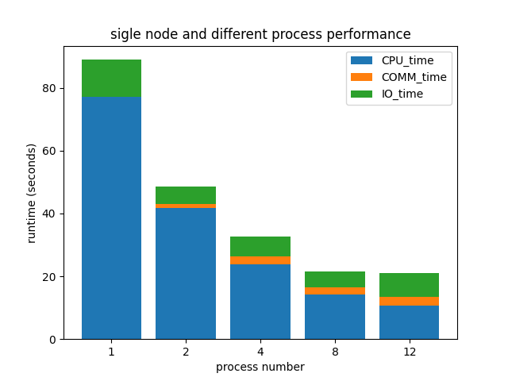
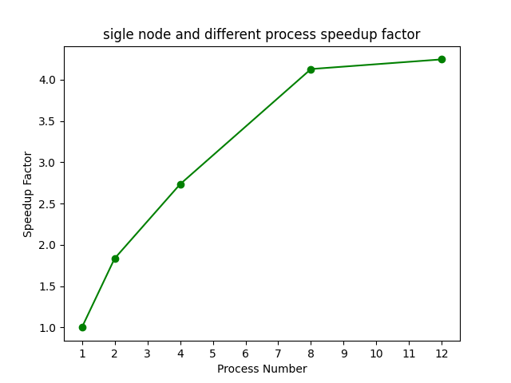
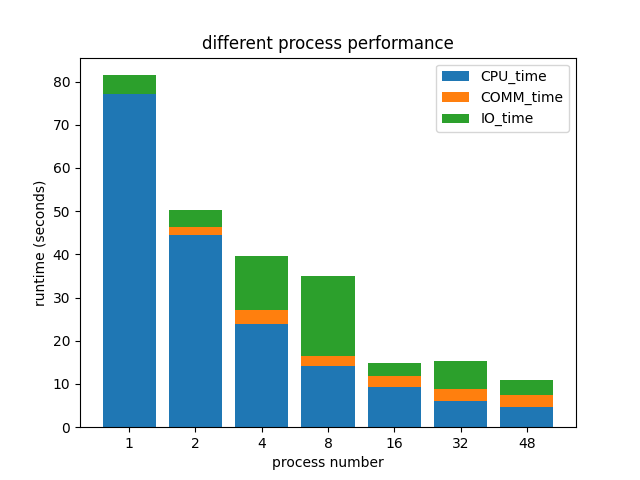
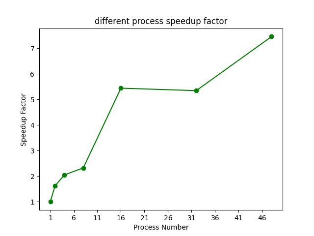

# Odd Even Sort Experiment Result

- Design serveral experiments to show the scalibility and speedup performance.
- Calculate the IO time, Computation time, Communication time repectively.

### Testcase Size
- Data Size: 536869888

### Single Node with Different Process Number Result
Different Process Performance        |  Speedup Factor
:-------------------------:|:-------------------------:
  |  

### Multiple Nodes with Different Process Number Result
Different Process Performance        |  Speedup Factor
:-------------------------:|:-------------------------:
  |  
